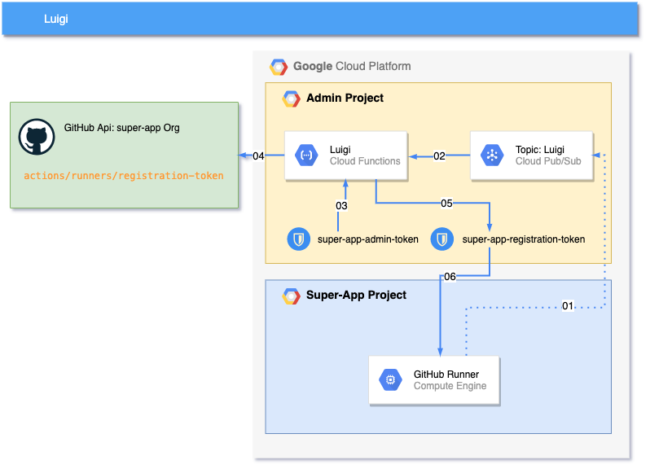

# Luigi

Get a GitHub self-hosted runners in GCP with **Luigi** 

`Luigi` is a practical application of FTSE (fundamental theorem of software engineering):
> "All problems in computer science can be solved by another level of indirection"
> 
> Cit. Butler Lampson

<div style="text-align:center">
    
</div>

This page explains how to allow GitHub Organization users to provision their self hosted-runners (in GCP) without exposing a PAT with admin:org privileges.

To do this we need:
- Cloud Functions
- PubSub
- 2+ Secrets in GSM

<div style="text-align:center">
    
</div>

The first secret contains the GitHub token we use to generate the self-hosted runners `registration tokens`.
The backgroung function, has accessor privileges to the secret containing the GitHub token. With this token the function can request a registration token (via GH API request) and store it in a second secret accessible by the invoker of the function.

PubSub is used to trigger the background function, the message contains the name of the GH Org of the invoker.
```bash
export PROJECT_ID="gcp-project-id"
export PUBSUB_TOPIC="luigi"
export GH_ORG="github-org-name"
export GH_ORG_TOKEN="ghp_aValidGitHubToken"
export SERVICE_ACCOUNT_ID="luigi-fn-sa"

#Create PubSub Topic
gcloud pubsub topics create $PUBSUB_TOPIC --project=$PROJECT_ID

#Create Secret
echo -n "$GH_ORG_TOKEN" | gcloud secrets create ${GH_ORG}-admin-token \
      --data-file=- \
      --replication-policy automatic \
      --project=$PROJECT_ID

gcloud secrets create ${GH_ORG}-registration-token \
      --replication-policy automatic \
      --project=$PROJECT_ID

#Create a service account for the google function
gcloud iam service-accounts create $SERVICE_ACCOUNT_ID \
    --description="Runtime Service Account for Luigi function" \
    --display-name="Luigi Function SA" \
    --project=$PROJECT_ID

#This is needed to deploy the function when using non default service account
gcloud iam service-accounts add-iam-policy-binding \
    $SERVICE_ACCOUNT_ID@$PROJECT_ID.iam.gserviceaccount.com \
    --member=user:$(gcloud auth list --format="value(account)") \
    --role=roles/iam.serviceAccountUser \
    --project=$PROJECT_ID

#Granting Access to the admin token secret
gcloud secrets add-iam-policy-binding projects/$PROJECT_ID/secrets/${GH_ORG}-admin-token \
   --member="serviceAccount:$SERVICE_ACCOUNT_ID@$PROJECT_ID.iam.gserviceaccount.com" \
   --role="roles/secretmanager.secretAccessor"

#Role binding to read the admin-token secret and the updated the registration tokens 
gcloud projects add-iam-policy-binding $PROJECT_ID \
    --member="serviceAccount:$SERVICE_ACCOUNT_ID@$PROJECT_ID.iam.gserviceaccount.com" \
    --role="roles/secretmanager.secretVersionManager"

gcloud functions deploy luigi --region=europe-west1 \
  --trigger-topic=$PUBSUB_TOPIC \
  --project=$PROJECT_ID \
  --memory=128MB \
  --max-instances=1 \
  --runtime=go113 \
  --service-account=$SERVICE_ACCOUNT_ID@$PROJECT_ID.iam.gserviceaccount.com \
  --source=./function \
  --set-env-vars project_id=$PROJECT_ID \
  --entry-point=Luigi

```

now that the function is deployed the registration token can be refreshed by calling:

`gcloud pubsub topics publish $PUBSUB_TOPIC --message=$GH_ORG --project=$PROJECT_ID`

Don't forget to grant secret accessor privileges to the secret consumer services account.
